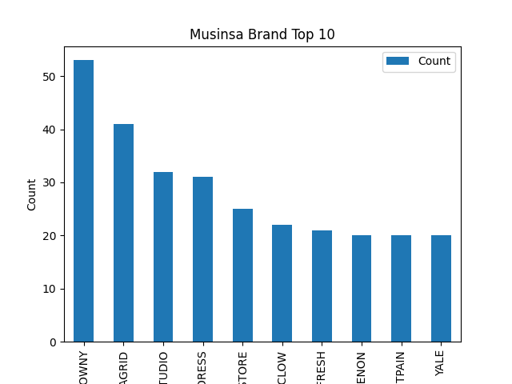
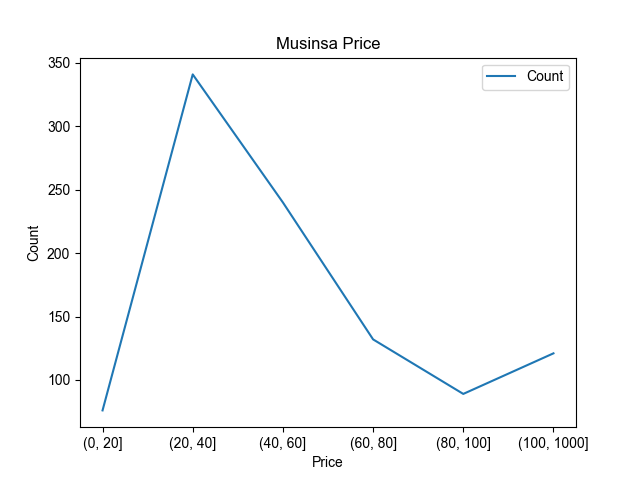
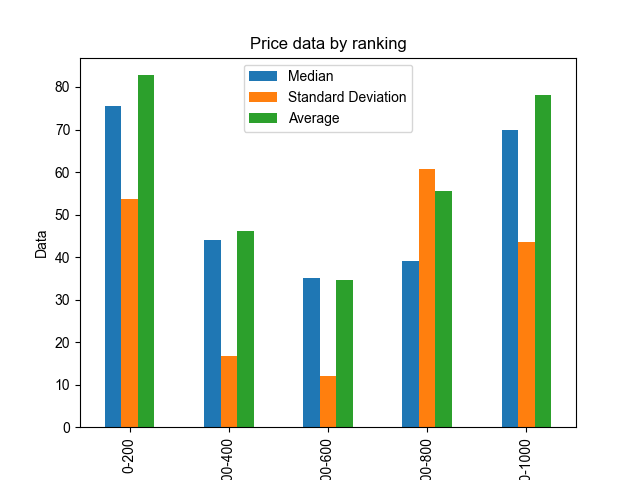

# Data Analytics Report

## 1. Introduction
### Website: Musinsa
Musinsa is South Korea's largest online editing shop and the 10th unicorn company. 
It handles a wide range of products, including bags and accessories, as well as clothing.

### Target Variables
1. Brand : Brand Name in Musinsa Ranking
2. Price : Product Price

 

## 2. Business Intelligence Questions
### 1. Which brands are the most popular? - TOP 10

This graph shows what the top 10 brands in Musinsa are and how many times each brand has appeared in the ranking. 
The x-axis is the brand name, and the y-axis is the number of times it has appeared in the ranking.

First, I counted the number of appearances of all brands in the ranking. 
Second, Top 10 were extracted in the order of the highest number of appearances.

The following is the result of the graph.

| Brand         | Count |
|---|---|
| GLOWNY        | 53   |
| MAHAGRID      | 41   |
| 1993STUDIO    | 32   |
| AVANDRESS     | 31   |
| LAFUDGESTORE  | 25   |
| RECLOW        | 22   |
| AFRESH        | 21   |
| NONENON       | 20   |
| SAINTPAIN     | 20   |
| YALE          | 20   |

 

### 2. How much will the price affect the ranking?
#### 2-1) Most appeared price in the ranking

This graph shows the number of appearances in the ranking by price. 
The X-axis is divided by price into [0, 20, 40, 60, 80, 100, ---]. 
The Y-axis is the number of appearances in the ranking.
The price unit is dollar($).

The graph shows that clothing between $20 and $40 is the most popular.
The next most purchased price is between $40 and $60.

More detailed figures for prices were calculated from the following graphs.

 

#### 2-2) Median price, standard deviation, and average for each ranking range

This graph calculates the median, standard deviation, and average of prices by ranking. 
Ranking ranges are divided into [0, 200, 400, 600, 800, 1000].

Rank 1-200 and Rank 800-1000 have a high price average, but a large standard deviation, other rankings are all similar, with an average of $30-$60.
Therefore, similar to the results shown in the second graph, it can be seen that the most purchased price is between $20$ and $60 regardless of ranking.

 

## 3. Conclusion
The top three most popular brands in Musinsa are Glowny, Mahagrid, and 1993studio. 
In addition, the most popular prices are $20 to $60.
